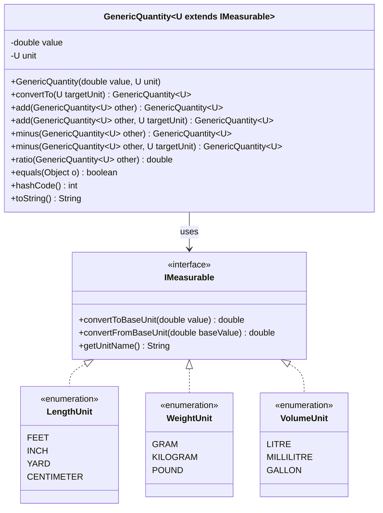

# 📏 Quantity Measurement Application

[](https://www.oracle.com/java/)
[](#-core-architecture)
[](#-design-decisions--patterns)
[](#-verification--testing)

An elegant, type-safe, and highly extensible Java-based measurement conversion and arithmetic engine. Designed with strict object-oriented and SOLID principles, the application supports comparing, converting, and performing arithmetic operations across **Length**, **Weight**, and **Volume** domains while guaranteeing compile-time safety and physical consistency.

---

## 🚀 Key Features

*   🔒 **Compile-Time Type Safety**: Implemented via Java Generics to prevent cross-category operations (e.g., you cannot add weight to volume or compare length with weight).
*   🔄 **Dynamic Conversions**: A generic conversion engine that normalizes measurements using base unit ratios.
*   ➕➖➗ **Comprehensive Arithmetic**: Implements Addition, Subtraction (with target unit specification), and Division (calculating dimensionless scalar ratios).
*   🛡️ **Immutable Design**: Instances of measurements are immutable to prevent unintended side effects and ensure thread safety.
*   🧩 **Polymorphic Enums**: Leverages Java enums implementing strategy interfaces to encapsulate unit conversion factors cleanly.

---

## 🧱 Core Architecture

The architecture decouples the physical quantity logic from the specific unit implementation. The core components are:

1.  **`IMeasurable`** (Interface): Defines the contract for all unit enums. It encapsulates the conversion logic to and from a category's base unit.
2.  **`GenericQuantity<U extends IMeasurable>`** (Class): A generic container holding a numeric value and its corresponding unit. It handles equality checks, unit conversion, addition, subtraction, and ratio calculations.
3.  **Unit Enums** (`LengthUnit`, `WeightUnit`, `VolumeUnit`): Concrete enums that implement `IMeasurable` and manage unit-specific factors.

### Class Diagram



---

## 📊 Supported Units & Categories

Each category uses a specific **Base Unit** to which all other units are normalized under the hood:

| Category | Base Unit | Supported Units & Conversion Factors |
| :--- | :--- | :--- |
| **Length** 📏 | **Inch** | <ul><li>`INCH` (1.0)</li><li>`FEET` (12.0)</li><li>`YARD` (36.0)</li><li>`CENTIMETER` (0.4 / ~2.54 cm per inch)</li></ul> |
| **Weight** ⚖️ | **Kilogram** | <ul><li>`KILOGRAM` (1.0)</li><li>`GRAM` (0.001)</li><li>`POUND` (0.453592)</li></ul> |
| **Volume** 🧪 | **Litre** | <ul><li>`LITRE` (1.0)</li><li>`MILLILITRE` (0.001)</li><li>`GALLON` (3.78541)</li></ul> |

---

## 🚀 Use Case Progression (UC1 - UC12)

The application was developed incrementally following test-driven development (TDD):

### 🔹 UC1: Feet Equality
Initial comparison requirement. Compares two values in feet.
*   *Example:* `1.0 ft == 1.0 ft → true`

### 🔹 UC2: Feet & Inches Equality
Introduces inches, handling them as separate, parallel comparisons.
*   *Example:* `1.0 in == 1.0 in → true` (Feet and Inches cannot be compared yet)

### 🔹 UC3: Length Equality Refactoring (DRY)
Unifies feet and inches using a single class and an enum with base unit normalization (converting to inches/feet under the hood).
*   *Example:* `1.0 ft == 12.0 in → true`

### 🔹 UC4: Extended Length Units
Adds `YARD` and `CENTIMETER` without modifying core comparison logic.
*   *Example:* `1.0 yd == 36.0 in → true`, `1.0 cm == 0.4 in (approx) → true`

### 🔹 UC5: Unit Conversion API
Introduces a conversion API to change quantities between units.
*   *Example:* `1.0 ft` converted to `INCH` yields `12.0 in`

### 🔹 UC6: Addition of Lengths
Supports adding two measurements of the same category, returning the result in the unit of the first operand.
*   *Example:* `1.0 ft + 12.0 in = 2.0 ft`

### 🔹 UC7: Addition with Target Unit Specification
Enhances addition to allow specifying a custom target unit for the resulting quantity.
*   *Example:* `1.0 ft + 12.0 in` targeting `YARD` = `0.67 yd`

### 🔹 UC8: Architectural Refactoring
Decouples unit conversion factors from the core class and moves them into a standalone enum to improve cohesion.

### 🔹 UC9: Weight Category Support
Extends the framework to support weight units (`KILOGRAM`, `GRAM`, `POUND`) with their own equality, conversion, and addition.
*   *Example:* `1.0 kg == 1000.0 g → true`

### 🔹 UC10: Generic Quantity Refactoring
Introduces the generic `Quantity<U extends IMeasurable>` class. This uses compile-time checks to prevent mismatched arithmetic.
*   *Example:* `Quantity<LengthUnit>` and `Quantity<WeightUnit>` cannot be compared or added at compile time.

### 🔹 UC11: Volume Category Support
Leverages the generic architecture to seamlessly add `LITRE`, `MILLILITRE`, and `GALLON` without changing core code.
*   *Example:* `1.0 gallon == 3.785 litres → true`

### 🔹 UC12: Subtraction & Division
Completes the arithmetic suite by supporting subtraction (with custom target units) and division (returning a dimensionless scalar ratio).
*   *Example:* `1.0 Litre - 250 ml = 0.75 Litre`, `1.0 Litre / 250 ml = 4.0` (Scalar ratio)

---

## 💻 Code Usage Examples

### 1. Creating Quantities & Type-Safe Operations

```java
// Length Quantities
GenericQuantity<LengthUnit> oneFoot = new GenericQuantity<>(1.0, LengthUnit.FEET);
GenericQuantity<LengthUnit> twelveInches = new GenericQuantity<>(12.0, LengthUnit.INCH);

// Weight Quantities
GenericQuantity<WeightUnit> oneKg = new GenericQuantity<>(1.0, WeightUnit.KILOGRAM);
GenericQuantity<WeightUnit> thousandGrams = new GenericQuantity<>(1000.0, WeightUnit.GRAM);
```

### 2. Equality and Conversion

```java
// Cross-unit equality (Length)
boolean lengthsEqual = oneFoot.equals(twelveInches); // returns true

// Cross-unit equality (Weight)
boolean weightsEqual = oneKg.equals(thousandGrams); // returns true

// Conversion
GenericQuantity<LengthUnit> converted = twelveInches.convertTo(LengthUnit.FEET);
System.out.println(converted); // GenericQuantity{value=1.0, unit=FEET}
```

### 3. Compile-Time Safety Guard

```java
// The following line will fail to compile, preventing logical errors!
// oneFoot.equals(oneKg); 

// Mismatched arithmetic also fails at compile time:
// oneFoot.add(oneKg); // Compiler error!
```

### 4. Arithmetic (Addition, Subtraction, and Ratio)

```java
// Addition (Implicit Target Unit: first operand)
GenericQuantity<LengthUnit> lengthSum = oneFoot.add(twelveInches); // Result: 2.0 FEET

// Addition (Explicit Target Unit)
GenericQuantity<LengthUnit> sumInYards = oneFoot.add(twelveInches, LengthUnit.YARD); // Result: 0.67 YARD

// Subtraction
GenericQuantity<LengthUnit> lengthDiff = oneFoot.minus(twelveInches); // Result: 0.0 FEET

// Division/Ratio (Dimensionless Scalar)
GenericQuantity<VolumeUnit> oneLitre = new GenericQuantity<>(1.0, VolumeUnit.LITRE);
GenericQuantity<VolumeUnit> quarterLitre = new GenericQuantity<>(250.0, VolumeUnit.MILLILITRE);
double ratio = oneLitre.ratio(quarterLitre); // Result: 4.0
```

---

## 💡 Design Decisions & Patterns

*   **Strategy Pattern**: Unit enums act as strategies for conversion. The `IMeasurable` interface defines the conversion algorithms, and each enum constant defines its unique factor/formula.
*   **Open/Closed Principle (OCP)**: Adding new categories (e.g., Temperature, Speed) is done by creating a new enum implementing `IMeasurable`. No changes to `GenericQuantity` are needed.
*   **Liskov Substitution Principle (LSP)**: Any unit category enum implementing `IMeasurable` can be substituted dynamically into `GenericQuantity<U>`.
*   **Single Responsibility Principle (SRP)**:
    *   `GenericQuantity` is responsible only for handling quantity values and arithmetic operations.
    *   Unit Enums (`LengthUnit`, etc.) are responsible only for defining unit conversion factors and labels.

---

## 🧪 Verification & Testing

The project has a suite of JUnit 5 unit tests covering:
*   Cross-unit equality and precision limits (e.g., float precision tolerances).
*   Unit conversion accuracy.
*   Commutative and associative properties of addition and subtraction.
*   Division checks including division by zero exceptions.
*   Strict validation checks (rejecting null units, infinite values, and mismatched category operations).

### Running Tests

To run the unit test suite locally:

```bash
# If using Gradle
./gradlew test

# If using Maven
mvn test
```
